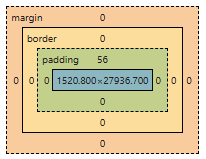

# HTML Mark Up language

---

## Basic HTML document structure

```html
<!doctype html>
<html lang="en">
<head>
  <title>Document</title>
</head>
<body>
  <div>
    <h1>
      Hello world
    </h1>
    
  </div>
</body>
</html>
```

---

## Box model

1. Every HTML element is rendered as a rectangular box in the browser.
2. An HTML element consists of content, padding, border, and margin.


---

## HTML tags

There are 3 groups:

1. Inline
2. Block
3. Inline-block


---

## HTML inline tags

Properties:
1. They occupy the width of the content.
2. An inline tag begins immediately after the previous inline tag and wraps to a new line if it doesn't fit on the current line.
3. Width and height usually do not apply to inline elements (except replaced elements like ).
4. Only left/right margins work.
5. Padding can be specified.
6. Inline elements can contain other inline elements, but cannot contain block elements.

---
<!-- .slide: style="font-size: .8em" -->
## HTML inline and inline-block tags

Inline:
- `<a>` — link to a web resource
- `<br>` — line break
- `<span>` — inline container
- `<label>` — label for form controls


Inline-block:
- `<input>` - render different types of interactive element:<br />
 text input, checkbox, radio button, button, text area
- `<button>` - render button
- `<select>` - parent tag for rendering drop down selector
- `` - render picture

---

## HTML inline tag &lt;a>

Mandatory attribute href

```html
<a href="{value}">Link to some page</a>
```

value:
- https://some.url.com - redirect to the path
- mailto:mail@some.com - open mail client
- tel:+37523222569874 - an attempt to make a phone call 
- #{some value} - scroll the page to the item with correspond id {some value}
---


## HTML inline tag &lt;a>

Optional attribute target

```html
<a href="https://google.com" target="{value}">Link to some page</a>
```
value:
- _blank - link will be opened in the new browser tab
- _self - link will be opened in the same browser tab
- {any value} - link will be opened in the new tab only on the first attempt, rest will be opened in the same tab
---

## HTML inline tag &lt;img>

Mandatory attribute src

```html

```

- value - link to the image
---

## HTML block tags
Properties:
1. They occupy the full available width.
2. Always starts from the new line.
3. Dimensions (width/height) can be specified.
4. All margins work.
5. Padding can be specified.
6. Any types of tags can be nested.


---

## HTML block tags

Basic block tags:
```html
<div> – Generic container
<p> – Paragraph
<h1> to <h6> – Headings
<section> – Thematic grouping of content
<ul> – Unordered list
<ol> – Ordered list
<li> – List item (block-level inside lists)
<figure> – Self-contained media/content
```

---

## CSS - Cascading Style Sheets

There are 3 options to add styles to the tag
1. Inline styles
2. Internal styles via &lt;style> tag
3. Link external file with styles

---

## CSS - Cascading Style Sheets

Inline styles
```html
<span style="font-size: 30px; color: green;">Hell
  o</span>
<span style="font-size: 45px;"> world</span>
```
<span style="font-size: 30px; color: green;">Hell
o</span> <span style="font-size: 45px"> world</span>

---

## CSS - Cascading Style Sheets

Internal styles via &lt;style> tag

Inline styles
```html
<style>
  .header {
    color: green;
  }
</style>
<span class="header">Hello world</span>
```
<style>
  .header {
    color: green;
  }
</style>
<span class="header">Hello world</span>

---

## CSS - Cascading Style Sheets

Link external stylesheet {name}.css
```html
<!doctype html>
<html lang="en">
<head>
  <link rel="stylesheet" href="./{name}.css" />
  <title>Document</title>
</head>
<body>
  <span class="header">Hello world</span>
</body>
</html>
```
---

## CSS - Cascading Style Sheets

Units:
- Absolute
- Relative

---

## CSS - Cascading Style Sheets
Absolute units:

- px (2.54cm/96)
- mm
- pt
- in

---

## CSS - Cascading Style Sheets

Relative units:
- %
- em
- rem
- vw / dvw
- vh / dvh
- vmin
- vmax

---

## CSS - Cascading Style Sheets

CSS selectors:

```html
<div id="some-id" class="class-name">Hello world</div>
```
```css
<style>
  #some-id { } /* select item by id */

  .class-name {} /* select item by class name */

  [class="class-name"] /* select item by attribute */

  div {} /* select item by tag name */

  * {} /* any item will be selected */
</style>
```

---

## CSS - Cascading Style Sheets

CSS syntax

```css
.class-name {
  {property name}: {property value};
  {property name}: {property value};
}

#id {
  {property name}: {property value};
}

```
---
## CSS – display property

The `display` property defines how an element is rendered and how it participates in layout.

Common values:

```css
display: block;
display: inline;
display: inline-block;
display: none;
display: flex;
display: grid;
```
---
## CSS – Specificity

CSS specificity defines which styles are applied when multiple rules target the same element.

Rules with higher specificity override rules with lower specificity.

---

## CSS – Specificity order (from lowest to highest)

1. Universal selector (`*`)
2. Tag selector (`div`, `p`)
3. Class / attribute / pseudo-class (`.class`, `[type="text"]`)
4. ID selector (`#id`)
5. Inline styles (`style=""`)

---

## CSS – Specificity example

HTML:
```html
<div id="title" class="header">Hello world</div>
```
```css

#title {
  color: red;
}
#title {
      color: green;
}
div {
  color: black;
}
.header {
  color: blue;
}

```
<div class="example">
<div id="title" class="header">Hello world</div>
</example>
<style>
  .example {
    div {
      color: black;
    }

    .header {
      color: blue;
    }

    #title {
      color: red;
    }
    #title {
      color: green;
    }
}
</style>